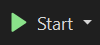

# PROG 7311 POE Part 2 ST10390916

Changes made for part 3:
 - Changed the name of the database from PROG7311DB to PROG7311DBVolschenk as this could have matched other students database names and caused problems on the marker's computer.
 - Added more pre-populated data and added pre-populated users to fix the auto-login feature.
# How to run this app locally using Visual Studio:

Open the github link that will take you to the project repository in GitHub.

Click the code button.
 

Click Download zip to download the files. Save the file in a location you can find later.

Locate the file in your file explorer and extract all the files.

Open the solution file (.sln) in Visual studio.

When the solution is open in Visual Studio click the Start button in the panel at the top of the screen.
 

The website will then open in your browser and it can be used/marked.

The first screen you'll see is the home page. This page briefly describes what the purpose of the website is. 

You can then log in using the login button at the bottom of the page or the login tab in the navigation bar on top.

The login screen is a simple page with two input fields. This is where a user will enter their details (email and password) to log in. 

There are only two types of users namely, a farmer and an employee user. The farmer user will use the platform to list products that they are selling. They can also view the products that other farmers are selling. This will enable them to see and contact other farmers if they are interested in buying. 

The employee user acts as an admin user as they can add new farmers to the system. Like the farmers, they can also view the products that farmers list.

Once a user is logged in, they will be taken to the marketplace page where they can view all the products that have been listed by farmers on the system. They can filter the products by the category that product falls into or they can filter it by production date of each product. They can click the farmer's name on a product card to go to their profile page and view their contact details.

If an employee user is logged in they will also see a tab for a page called "Add a farmer". On this page they can enter the details needed to create and add a new farmer to the system.

If a farmer user is logged in they will also see a tab for a page called "Add product". On this page they can enter the details needed to create and list a new product to the system.
